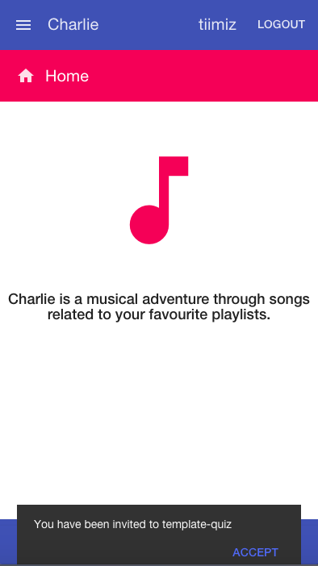
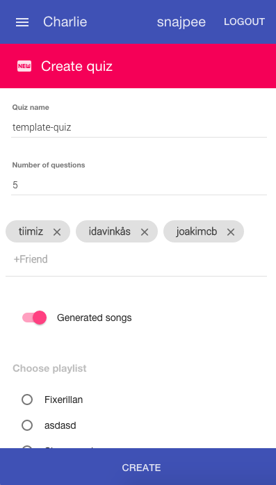
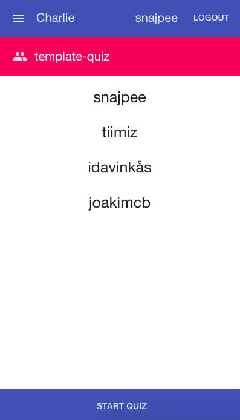
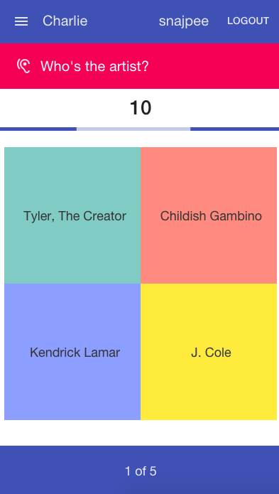
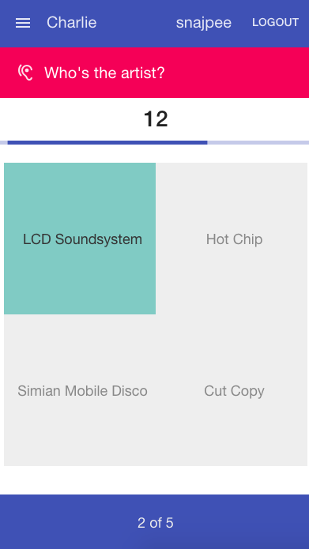
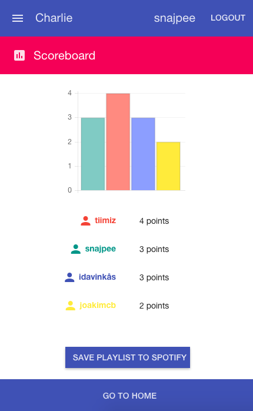
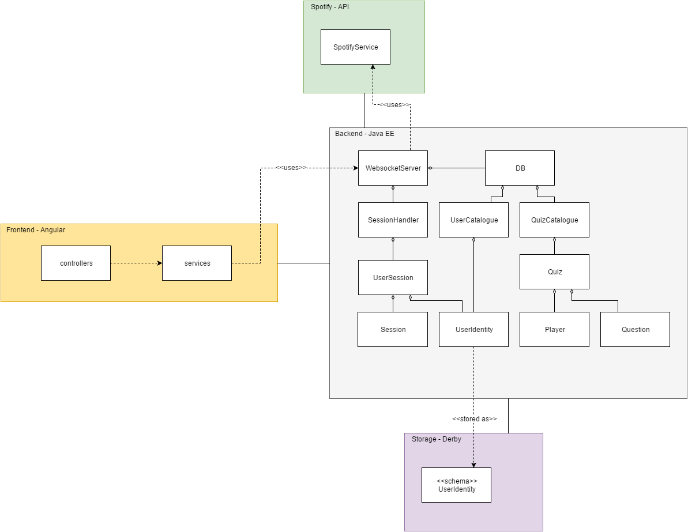

# Charlie
A spotify based musical quiz application.

## About
This project was created in Mars, 2016. The purpose of the application is to simplify the task to create and distribute music quizes. 

### Presentation
A presentation made at the end of this project, 2016-03-14.

[presentation.pdf](docs/presentation.pdf)

## Contributors
All members are students of Chalmers University of Technology, Software Engineering. This project was created for the course "DAT076 - Web Applications".

| Name         		| SSN       | Email  						|
| ----------------- |:---------:| ----------------------------- |
| Erik Nordmark     | 870907 	| erinord@student.chalmers.se 	|
| Joakim Berntsson  | 940524    | joabern@student.chalmers.se 	|
| Simon Takman 		| 930321    | takman@student.chalmers.se 	|
| Tim Kerschbaumer  | 931022	| ktim@student.chalmers.se		|

### SLOC
The git inspector was quite troublesome for us during this project. If someone auto indented or made a special merge, several hundred rows could be transfered from one person to another. This lead to some members being below the required limit for SLOCs. 

## Overview
The application is a spotify based music quiz, which lets the user invite friends, choose a playlist and start a quiz based on that playlist. The creator will have control of the music but no other special permissions is given to the creator.

### Permissions and requirements
The application requires a spotify account, network connection and a modern web browser. 

### Use cases
The use cases includes name, goal, actors, precondition, main flow, alternative flow and postcondition. 

[use-cases.pdf](docs/use-cases.pdf)

### Graphical interface

#### Home



#### Create Quiz


#### Lobby


#### Questions




#### Scoreboard


## Technical design
The application is built with AngularJS as the frontend application and Java EE as the backend solution. 

### UML


### Approach
The application is built with the service based approach pattern.

### Layers
#### Model
```
Charlie/src/main/java/core/Player.java
Charlie/src/main/java/core/Question.java
Charlie/src/main/java/core/Quiz.java
Charlie/src/main/java/core/User.java
Charlie/src/main/java/core/UserIdentity.java
Charlie/src/main/java/core/UserSession.java
```
	
#### Persistence
```
Charlie/src/main/java/core/UserIdentity.java
Charlie/src/main/java/core/User.java
```

#### Service
```
Charlie/src/main/java/core/SpotifyService.java
```

#### Communication
```
Charlie/src/main/java/web/WebsocketServer.java
```

#### Control
```
Charlie/src/main/webapp/app/js/controllers.js
```
	
#### View
```
Charlie/src/main/webapp/app/partials/create.html
Charlie/src/main/webapp/app/partials/profile.html
Charlie/src/main/webapp/app/partials/home.html
Charlie/src/main/webapp/app/partials/lobby.html
Charlie/src/main/webapp/app/partials/question.html
Charlie/src/main/webapp/app/partials/scoreboard.html
```

### Libraries
- Java Enterprise Edition
- Michaelthelin Spotify API
- Google Gson
- Apache Derby
- JUnit
- Arquillian
- Jasmine
- Angular
- Bootstrap
- JQuery

## Setup
This section explains how to setup and run the project and its tests.

### Run project
To run this project follow the instructions below.
```
git clone https://github.com/jcberntsson/Charlie.git
```
Then open the project in Netbeans and add a database called "db" in the services tab. 

### Run Jasmine tests
To run the jasmine tests do the following.
```
git clone https://github.com/jcberntsson/Charlie.git
cd Charlie
npm install
karma start
```

### Run JUnit and Arquillian tests
To run the JUnit and Arquillian tests for this project do the following.
```
git clone https://github.com/jcberntsson/Charlie.git
```
Open in Netbeans and run test files: 
```
Charlie/src/test/java/TestUserPersistence.java
Charlie/src/main/test/core/PlayerTest.java
Charlie/src/main/test/core/QuestionTest.java
Charlie/src/main/test/core/QuizTest.java
Charlie/src/main/test/core/SpotifyServiceTest.java
```
